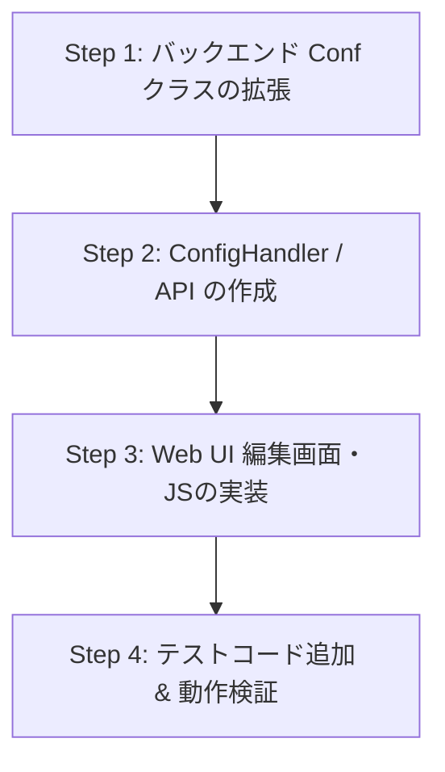

# 機種別設定編集機能の実装計画書 (Model Config Editor Plan)

## 1. 概要
`ytstreetorgan` Webアプリケーションにおいて、ストリートオルガンの機種（`20notes`, `34notes` 等）ごとの設定内容（ブック高さ、ピッチ、マージン、音階オフセットなど）をブラウザ上から閲覧・編集・保存できる機能を追加します。

---

## 2. 目標と要件

### 機能要件
1. **機種設定の閲覧・選択**
   - 登録されている機種一覧を取得し、選択した機種のパラメータを表示する。
2. **設定内容の編集・更新**
   - 各パラメータ（数値設定、音名リスト `note name`、ノートオフセット `note offset`、メモなど）を画面から編集可能にする。
   - 「保存」ボタンで `storgan-conf.json` へ変更を反映・永続化する。
3. **新規機種の追加・削除（拡張性）**
   - 新しい機種設定の追加、既存機種の複製・削除を行えるようにする。
4. **入力バリデーションと安全性**
   - 数値項目の型チェック（float, int）。
   - 音名配列とオフセット配列の要素数一致チェック。
   - 設定ファイル更新時の自動バックアップ作成 (`storgan-conf.json.bak`)。

---

## 3. システムアーキテクチャと変更箇所

### 3.1. バックエンド (`src/ytstreetorgan/`)

#### `conf.py` (`Conf` クラス)
- **`save(self) -> bool`**: 現在の `self.data` を `storgan-conf.json` にJSON書き出し（アトミック書き込み・バックアップ作成付き）。
- **`update_model(self, model_name: str, new_conf: ModelConf) -> bool`**: 指定機種の設定を更新。
- **`add_model(self, new_conf: ModelConf) -> bool`**: 新規機種を追加。
- **`delete_model(self, model_name: str) -> bool`**: 指定機種を削除。
- **`validate_config(conf: ModelConf) -> tuple[bool, str]`**: 設定値の整合性チェック。

#### `handler1.py` / 新規 `config_handler.py`
- 設定編集用ルート (`/storgan2/config`) の追加。
- **GET `/storgan2/config`**: 機種一覧および選択された機種の設定データ編集画面を表示。
- **POST / PUT `/storgan2/config/save`**: フォームからの編集データを受け取り、`Conf` を更新・保存。結果をJSON/リダイレクトでレスポンス。

#### `webapp.py` (`WebServer` クラス)
- 新しいルーティングの登録:
  - `(r'%s/config.*' % self._urlprefix, ConfigHandler)`

---

### 3.2. フロントエンド (`webroot/`)

#### `webroot/templates/config_editor.html` (または `storgan.html` へのモジュール組み込み)
- タブまたはドロップダウンによる機種切り替え。
- 各種設定項目用フォーム（Input フィールド）:
  - 基本情報: `model`, `book height`, `margin`, `pitch`, `hole height`, `1sec`, `base note`
  - ブリッジ設定: `bridge width`, `bridge interval`, `bridge threshold`
  - メモ: `memo`
  - 音階テーブル (`note name`, `note offset`): インタラクティブな行追加/削除/並び替えテーブル。
- Bootstrap 4 ベースのレスポンシブ UI。

#### `webroot/static/js/config_editor.js`
- JSONデータの動的読み込みおよびフォームへの自動バインド。
- `note name` と `note offset` の動的編集UI制御。
- フォームバリデーション（クライアントサイド）。
- 非同期 (fetch API) による保存処理および成功/エラーアラート表示。

---

## 4. 実装ステップ

### Step 1: バックエンド `Conf` クラス拡張
- `save()`, `update_model()`, `add_model()`, `delete_model()`, `validate_config()` の実装。
- 設定ファイル書き込み時のアトミック保存とバックアップ処理の実装。
- `tests/test_conf.py` にテストケースを追加。

### Step 2: Handler & ルーティング追加
- `ConfigHandler` を追加し、JSON REST API および テンプレート描画をサポート。
- Tornado WebServer にエンドポイントを追加。

### Step 3: Web UI の構築
- `storgan.html` に設定編集画面へのリンクを追加（ナビゲーションバー等の追加）。
- `config_editor.html` および専用 JS/CSS を作成。
- 音階リスト (`note name`, `note offset`) を直感的に編集できるテーブルUIを実装。

### Step 4: 検証とテスト
- Pytest による全機能単体テストを実行。
- Webアプリケーションを起動し、実際のブラウザ操作による表示・保存動作の検証。

---

## 5. 入力データ仕様とバリデーションルール

| 項目名                | 型         | 必須  | 説明 / 制約                                 |
| :----------------- | :-------- | :-- | :-------------------------------------- |
| `model`            | string    | ○   | 機種識別名（一意であること）                          |
| `book height`      | float     | ○   | ブック高さ (mm) > 0                          |
| `margin`           | float     | ○   | マージン (mm) >= 0                          |
| `pitch`            | float     | ○   | ピッチ (mm) > 0                            |
| `hole height`      | float     | ○   | 穴の高さ (mm) > 0                           |
| `1sec`             | float     | ○   | 1秒あたりの長さ (mm) > 0                       |
| `base note`        | int       | ○   | ベースMIDIノート番号 (0〜127)                    |
| `bridge width`     | float     | ○   | ブリッジ幅                                   |
| `bridge interval`  | float     | ○   | ブリッジ間隔                                  |
| `bridge threshold` | float     | ○   | ブリッジ閾値                                  |
| `note name`        | list[str] | ○   | 各トラックの音階名 (`note offset` と要素数が一致すること)   |
| `note offset`      | list[int] | ○   | 各トラックの半音オフセット (`note name` と要素数が一致すること) |
| `memo`             | string    | -   | 自由記述メモ                                  |

---

## 6. 進捗管理
進捗状況のトラックおよび各タスクの詳細なチェックリストは [PROGRESS_CHECKLIST.md](file:///home/ytani/work/ytstreetorgan/PROGRESS_CHECKLIST.md) にて管理します。

## 7. 今後の進め方
計画の承認後、Phase 1（バックエンド `Conf` クラス拡張）から順次実装を開始します。
