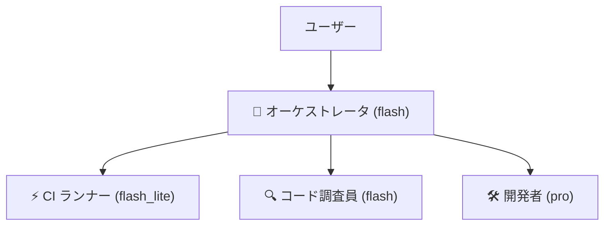
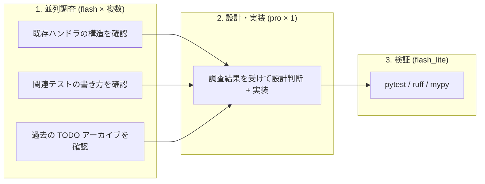

# マルチエージェントによるトークン節約の検討

作成: 2026-08-09

## 現状の問題

現在は **1 つのエージェント（Opus 級）がすべてを担当** しており、
以下のような「重いモデルでやるほどでもない仕事」にもフルサイズの
コンテキストとトークンが消費されている。

| よくあるタスク | 実際の難易度 |
|---|---|
| `git status` / `git log` を見て報告 | 低 |
| `pytest` / `ruff` / `mypy` を実行して結果を報告 | 低 |
| ファイルを読んで「○○はどうなっている？」に答える | 低〜中 |
| TODO.md のアーカイブ移行（定型作業） | 低 |
| コードの設計判断・リファクタリング | **高** |
| 複数ファイルにまたがるバグ修正 | **高** |

ただし、すべてを軽いモデルに振ればよいわけではない。
**タスクの性質に応じて、節約の手段が異なる。**

---

## タスク分類と方針

### 定型作業（テスト実行・git 操作など）

コマンドを実行して成否を報告するだけ。
`flash_lite` のサブエージェントに委任すれば **トークン節約に直結** する。

### 単純な質問・小さな修正

1〜2 ステップで終わるもの。サブエージェントを起動すると
通信のオーバーヘッドでかえって高くつく。
**flash 単体で直接応答** するのが最も効率的。

### 複雑なタスク（設計判断を伴う全体改造・新機能など）

このプロジェクトには、軽いモデルでは扱いきれない固有の制約が多い。

- **モジュール依存の方向** — `transpose.py` → `rollbook.py` は一方向。逆に import すると循環する
- **用語規約** — 「ノート」は使わず「MIDIノート番号」と書く、「落とす」は単独で使わない、等
- **SVG 座標系** — すべて負値、mm 単位
- **テンプレートの二重管理** — `_book_of()` と `book_from_svg()` の両方を直す必要がある
- **TODO 運用** — 項目追加と着手で別コミット、アーカイブの書式

これらは `CLAUDE.md`（約 19KB）に集約されているが、
**この知識を正しく使って判断する** のは軽いモデルには難しい。

複雑なタスクでは「トークンを減らす」よりも
**「正しい判断を 1 回で出して、やり直しを減らす」ことが最大の節約** になる。
軽いモデルで設計判断を間違えると、修正のやりとりで倍以上のトークンを使う。

したがって、複雑なタスクでの狙いは
**トークン節約ではなく、並列化による時間短縮と品質向上** に置く。

---

## エージェント構成




| エージェント | モデル | 役割 | 起動する場面 |
|---|---|---|---|
| オーケストレータ | flash | ユーザーの要求を受け、振り先を判断。結果を集約して報告 | 常時（メインエージェント） |
| CI ランナー | flash_lite | `pytest` / `ruff` / `mypy` / `git status` などの実行と結果要約 | 定型の検証作業 |
| コード調査員 | flash | コードベースの検索・ファイル読み取り・事実確認（設計判断はしない） | 影響範囲の調査、複数箇所の並列調査 |
| 開発者 | pro | 設計判断を伴うコード変更・リファクタリング | 本当にコードを書くときだけ |

---

### サブエージェント・メインエージェント別推奨設定

| エージェント | Gemini 推奨モデル & Effort | Claude 推奨モデル & Effort | 選定理由・特徴 |
|---|---|---|---|
| ci-runner<br>(単体テスト / Linter / 型チェック) | Gemini 2.5 / 3.0 Flash Lite<br>(effort: none または low) | Claude 3.5 Haiku<br>(effort: none または low) | トークン単価が最安かつ最速。コマンド実行と失敗ログの抽出・要約に推論思考（Thinking）は不要。 |
| browser-test-runner<br>(ブラウザ E2E テスト) | Gemini 2.5 / 3.5 Flash / Flash Lite<br>(effort: low) | Claude 3.5 Haiku / 3.7 Sonnet<br>(effort: low または standard) | Playwrightのログ要約やUIテスト失敗ステップの判定。簡単なコンテキスト理解。 |
| repo-status-checker<br>(Git & TODO運用確認) | Gemini 2.5 / 3.0 Flash Lite<br>(effort: none または low) | Claude 3.5 Haiku<br>(effort: none または low) | git status や TODO.md のフォーマット・リンク検証。推論コスト最小化。 |
| doc-style-auditor<br>(ドキュメント・用語規約監査) | Gemini 2.5 / 3.0 Flash Lite<br>(effort: low) | Claude 3.5 Haiku<br>(effort: low) | ファイルパスの存在チェックおよび grep結果（用語規約「ノート」禁止等）の確認。 |
| (参考)<br>メインエージェント / 開発者(設計判断・複雑なコード変更) | Gemini 3.5 Pro / 3.6 Flash<br>(effort: medium〜high) | Claude 3.7 Sonnet / 3 Opus<br>(thinking effort: medium〜high) | リポジトリ固有の制約遵守、影響範囲の把握、品質の高い設計判断。 |


## タスク別の使い方

### 定型作業の例:「プッシュしても問題ないか？」

| ステップ | 担当 |
|---|---|
| git status / log 確認 | CI ランナー (flash_lite) |
| pytest / ruff / mypy 実行 | CI ランナー (flash_lite) |
| TODO.md の確認 | CI ランナー (flash_lite) |
| 結果の集約・報告 | オーケストレータ (flash) |

### 単純な質問の例:「worktree 消していい？」

サブエージェント不要。オーケストレータ（flash）が直接
`git worktree list` を実行して回答する。

### 複雑なタスクの例: 新しい Web ハンドラの追加



**ポイント:**

- **調査だけ並列化** する。3 つの調査を直列にやると待ち時間が長いが、並列なら速い
- **設計と実装は分割しない**。1 つの pro エージェントが一貫して持つ。制約の見落としが減る
- **検証は分離** する。定型作業なので flash_lite で十分

### 並列調査が有効かどうかの目安

| タスク | 並列調査 | 理由 |
|---|---|---|
| 新しい Web ハンドラの追加 | ○ | 既存ハンドラ + テスト + テンプレートの確認が並列にできる |
| モジュール分割のリファクタリング | ○ | import 関係 + 影響テスト + アーキテクチャ制約の確認 |
| 単一ファイルのバグ修正 | × | 調査範囲が狭いので並列化の意味がない |
| 用語の一括置換 | × | grep 1 回で済む |

---

## 注意点・トレードオフ

### マルチエージェントが裏目に出るケース

- **簡単な質問にサブエージェントを起動する** — 起動・通信のオーバーヘッドで高くつく
- **文脈の受け渡しコスト** — 研究エージェントの出力 → オーケストレータ → 開発者と渡すたびにトークンを消費する。単一の pro が自分で読んだほうが安い場合がある
- **要約による情報の欠落** — 研究エージェントが「重要だが一見関係なさそうな制約」を落とすと、実装で間違える。
  👉 **対策:** 調査エージェントには「抽象的な要約」ではなく「該当ファイル名・関数名・コード構造・行番号などの一次情報」を直接出力させるプロンプトを与える。
- **ルールの伝達** — グローバルルール（TODO 運用、造語禁止など）を各サブエージェントに正確に伝える必要がある

### 判断の原則

常にマルチエージェントにすべきではない。
以下の場合はシングルエージェント（flash または pro の直接指定）のほうが効率的。

- 1〜3 ステップで終わる小さなタスク
- 会話の文脈（「さっきの続き」）が重要なやりとり
- 調査範囲が狭い修正

---

## 実装方法

### スキルとサブエージェントの違い

軽いモデルに作業を委任する仕組みは **サブエージェント** であり、
**スキルではない**。混同しやすいので整理する。

| 仕組み | 何をするか | モデル選択 | トークン節約 |
|---|---|---|---|
| スキル（`.agents/skills/xxx/SKILL.md`） | 手順書をエージェントのコンテキストに読み込む | 指定できない（呼び出し元のモデル） | しない（読み込み分むしろ増える） |
| サブエージェント（`invoke_subagent`） | 別のエージェントを起動して作業を委任する | `Model` パラメータで指定できる | **する**（`flash_lite` 等を指定） |

### 具体的な委任方法

`define_subagent` でシステムプロンプトに手順を書き、
`invoke_subagent` で `Model: flash_lite` を指定する。

```
invoke_subagent:
  TypeName: "ci-runner"       # define_subagent で事前定義
  Model: "flash_lite"         # 軽いモデルを指定
  Prompt: "pytest / ruff / mypy を実行して結果を報告して"
```

`define_subagent` は会話ごとに毎回必要になる。セッションをまたいで
再利用するには、以下の方法がある。

| 方法 | 説明 | 適性 |
|---|---|---|
| A. ルールファイルに方針を書く | 「検証が必要なときは flash_lite サブエージェントを定義して委任すること」とルールに記載 | **現実的** |
| B. 永続サブエージェントの配置 | `.agents/agents/<agent_name>/` またはプラグインの `agents/` に定義ファイルを置く | **推奨（再利用）** |
| C. グローバルルール（`~/.gemini/config/rules/`） | 全プロジェクト共通の方針として書く | 汎用部分のみ |
| D. 毎回手動で `define_subagent` | 会話ごとに実行する。最も柔軟だが定義のコストがかかる | 試行段階 |

### 自動化の注意

検証を自動的に（毎回）走らせると、ちょっとした修正でも
フルスイート（pytest 236件 + ブラウザテスト 42件）が実行される。
これは無駄なので、**検証の要否はエージェントまたはユーザーが
都度判断する** 現在の運用を維持するのがよい。

---

## 推奨する進め方

| 段階 | やること | 期待される効果 |
|---|---|---|
| 1. モデルの手動切り替え | タスクに応じて UI からモデルを選ぶ（すでに実施中） | 即効性のあるトークン節約 |
| 2. 定型検証のサブエージェント委任 | 「プッシュ前チェック」等の定型作業を `invoke_subagent` で flash_lite に委任 | 定型作業のコスト削減 |
| 3. 大規模タスクでのフル構成 | `/goal` や `/plan` を使う大きなタスクで、調査・実装・検証を並列化 | 時間短縮・品質向上 |

段階的に導入し、実際にトークンが減るか確認しながら進めるのがよい。
