# アーキテクチャ

MIDI ファイルからロールブック（穴あけ用の SVG）ができるまでの、内部の作り。
**コードを触る前に読む文書。**

- 使い方（画面の手順、コマンドのオプション）は [User.md](User.md)
- テスト・lint・型チェックの走らせ方は [Developer.md](Developer.md)
- 依存ライブラリと選定理由は [tech-stack.md](tech-stack.md)
- 画面側（CSS / JS）の決めごとは [`webroot/CLAUDE.md`](../webroot/CLAUDE.md)
- テストの書き方は [`tests/CLAUDE.md`](../tests/CLAUDE.md)

## 目次

- [1. 全体像](#1-全体像)
- [2. レイヤー分離](#2-レイヤー分離)
- [3. 設定ファイル](#3-設定ファイル)
- [4. SVG 座標系](#4-svg-座標系)
- [5. 穴の扱い](#5-穴の扱い)
- [6. Web 層](#6-web-層)
- [7. live reload](#7-live-reload)
- [8. ロールブックのビューア](#8-ロールブックのビューア)
- [9. ロギング](#9-ロギング)

## 1. 全体像

入口は CLI とブラウザの 2 つある。どちらも最後は `rollbook.py` の
`RollBook` に行き着き、同じ SVG を出す。

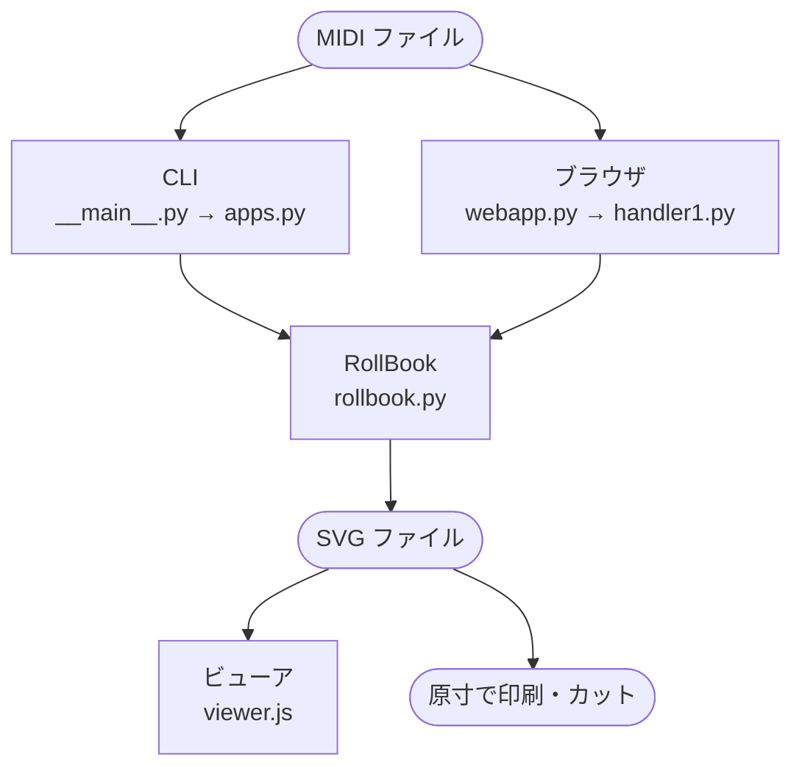

`__main__.py` は click のコマンド定義だけを持つ薄い層で、CLI 側のロジックは
`apps.py` の `RollBookApp` / `MidiApp` にある。ブラウザ側は Tornado の
ハンドラが `RollBook` を直接使う。

MIDI から SVG になるまでは、次の順に通る。

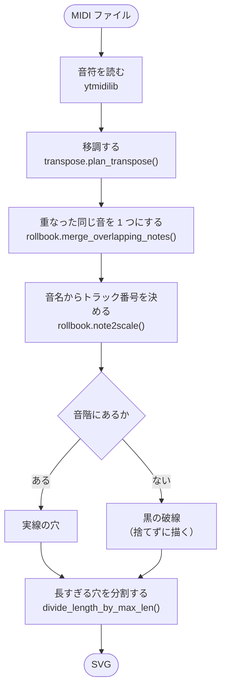

各段の詳細は [5. 穴の扱い](#5-穴の扱い) にある。

## 2. レイヤー分離

**モジュールの依存は一方向に保つ**（TODO-043）。矢印は import の向き。

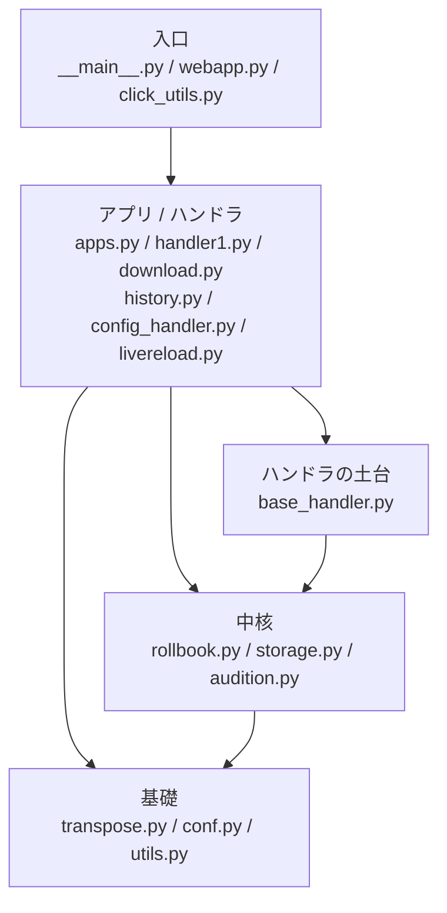

下の層は上の層を知らない。**逆向きの import を作らないこと。**

| モジュール | 受け持ち | import する先 |
|---|---|---|
| `__main__.py` | click のコマンド定義だけ | `apps` `webapp` `rollbook` `click_utils` |
| `webapp.py` | Tornado の起動と URL の割り当て | `conf` `handler1` `download` `history` `config_handler` `livereload` |
| `apps.py` | CLI 側のロジック。`RollBookApp` / `MidiApp` | `conf` `rollbook` `transpose` |
| `handler1.py` | ロールブックを作る画面 | `base_handler` `conf` `rollbook` `storage` `transpose` `utils` |
| `download.py` | 持ち帰りと試聴の 4 ハンドラ | `base_handler` `audition` `storage` `transpose` |
| `history.py` | 履歴の画面 | `base_handler` `conf` `rollbook` `storage` |
| `config_handler.py` | 機種設定の画面 | `base_handler` `conf` `rollbook` |
| `base_handler.py` | 全ハンドラの土台（TODO-075） | `storage` |
| `storage.py` | ファイル名の検証と置き場の解決。保存済み SVG の読み取り | `rollbook` `utils` |
| `audition.py` | 試聴用の MIDI。`playable_midi_bytes()` | `rollbook` |
| `rollbook.py` | 穴の位置と SVG。`note2scale()` / `HoleInfo` / `RollBook` | `conf` `transpose` |
| `transpose.py` | 移調。候補の作成・絞り込み・注記、`plan_transpose()`。並び順は `transpose_rank_key()`（TODO-052）。候補から画面用の値を作る `transpose_view()`（TODO-076） | `conf` |
| `conf.py` | 設定ファイルの探索・読み書き・検証。音名と MIDI ノート番号の変換 | （なし） |
| `livereload.py` | live reload の WebSocket と監視（[7 章](#7-live-reload)） | （なし） |
| `click_utils.py` | 共通オプションのデコレータ `click_common_opts()` | （なし） |
| `utils.py` | 単位を付けたサイズの表記 `get_size_unit()` | （なし） |

`mylog.py` はどこからでも import する（図と表では省いた）。

### 守ること

- **`__main__.py` は click のコマンド定義だけを持つ薄い層に保つ。**
  ロジックは `apps.py` の `RollBookApp` / `MidiApp` に置く（テスト可能に
  するため）。新しいサブコマンドを追加する場合もこの分離を守ること。
  共通オプション（`-h` / `-d` / `-V`）は `click_utils.py` の
  `click_common_opts()` デコレータで付与する
- **`transpose.py` から `rollbook.py` を import しないこと**（循環する）。
  移調は「どの高さで鳴らすか」だけの話で、穴の位置や SVG とは関係が無い。
  `play`（`MidiApp`）もブックを作らずに移調するので、切り離してある
- `note2scale()`（穴の列を決める）と `merge_overlapping_notes()`（TODO-038。
  実機は 1 音に 1 パイプ）は移調の都合ではないので `rollbook.py` に残す

### 同じ手順を 2 つ持たない

**移調の手順は `plan_transpose()` に 1 つだけ。** `RollBook.parse()` と
`MidiApp._convert_for_model()` が同じ手順をそれぞれ持っていて、
食い違いかけた（TODO-043）。増やさないこと。

同じ理由で、**機種設定の読み込みと検証は `conf.load_model_conf()` に
1 つだけ**、**移調量の正規化は `transpose.initial_transpose()` に 1 つだけ**
（TODO-073）。`RollBook.__init__` と `MidiApp.__init__` が、同じ日本語の
メッセージまで含めてそれぞれ持っていた。

## 3. 設定ファイル

モデル設定は `storgan-conf.json`。**リポジトリには含まれていない**。
`Conf` が次の順に探索し、最初に見つかったものを使う。

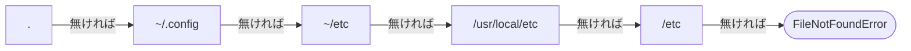

実運用の設定は `~/etc/storgan-conf.json` に置いてある。
`conf/storgan-conf.json` がテンプレート（テストもこれを複製して使う）。
見つからないと `Conf.__init__` が `FileNotFoundError` を投げるので、
設定に触るテストは必ずパスを明示するかモックする。

### 型が 2 つある（TODO-078）

`ModelConf` の**キーは生の JSON フィールド名**（`'book_height'`, `'pitch'` …）。
**すべて Python の識別子**なので、`class ...(TypedDict)` の形で定義してある。

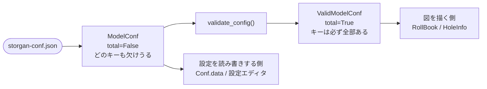

- `ModelConf` は生の JSON の形（どのキーも欠けうる）で、設定を読み書き
  する側（`Conf.data` と設定エディタ）が使う
- 図を描く側は `ValidModelConf`（`total=True`）を受け取り、`conf['pitch']` の
  形で読む。**`.get(key, 0.0)` で読まないこと**（0 が入ると黙って高さ 0 の
  図が出る）。`validate_config()` を通してこの型にするのが `load_model_conf()`

かつては `'book height'` のように空白入りで、関数形式でしか書けなかった。
**旧形式はもう読めない。**
`'1sec'` は数字始まりで識別子にできないため `'mm_per_sec'` に改名した
（`RollBook.mm_per_sec` に合わせた）。
`Conf.save()` は `.bak` を作ってから一時ファイル経由で原子的に置換する。

### トラックの定義

トラックの定義は `'notes'`（`list[str]`。要素は `'F4'` のような音名）。
リストの**並び順がそのままトラック番号**で、`note2scale()` はその index を返す。

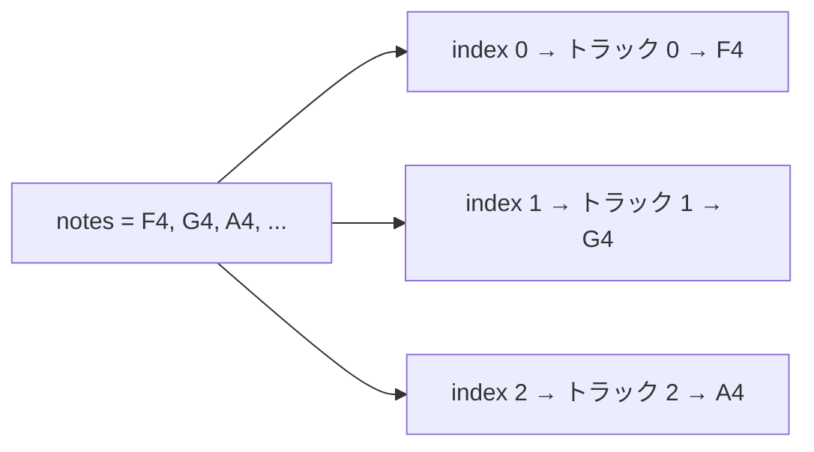

音名は国際標準（scientific pitch notation。MIDI ノート番号 60 = `C4`、
範囲は `C-1`〜`G9`、変化記号はシャープのみ）で、`note_name_to_midi()` /
`midi_to_note_name()` が MIDI ノート番号との変換を受け持つ。穴の位置は
音名だけで決まる（`note_name_to_midi()` で MIDI ノート番号に変換するだけ）。

かつては `'note name'` と `'note offset'` の 2 本の並行配列、その後は
`{'name': str, 'offset': int}` の辞書のリストで、半音単位のオフセットを
起点の音（`'base_note'`）との差として持たせていたが、`'offset'` を
設定に持たせず導出する形に変え（TODO-013、TODO-064）、さらに `'base_note'`
自体と、そこから導出していた「半音単位のオフセット」という中間の概念も
無くした（TODO-067）。

- **旧形式（`'note name'` / `'note offset'` の並行配列、`'offset'` を持つ
  辞書のリスト）はもう読めない**（`validate_config()` が弾く。自動変換はしない）
- `'base_note'` は違う扱いで、設定に残っていても**黙って無視する**
  （`validate_config()` はエラーにしない。値を使わなくなっただけなので、
  古い設定ファイルがそのまま読める）

## 4. SVG 座標系

**すべての座標が負値。** ロールブックは右から左へ流れるため、曲の先頭が
x=0（右端）にあり、時間が進むほど左（x が負の方向）へ伸びる。

```
                   ← 時間が進む方向
    ┌──────────────────────────────────────────┐  y = -book_height（上端）
    │  ┄┄      ▭          ▭        ▭      ▭    │  ← トラック 2（┄ は破線）
    │      ▭        ▭         ▭▭       ▭       │  ← トラック 1
    │  ▭      ▭▭▭        ▭        ▭            │  ← トラック 0
    └──────────────────────────────────────────┘  y = 0（下端 ＝ 原点）
  x = -width（曲の終わり）              x = 0（曲の先頭）
```

- `svg_square()` のパスは `M {-x},{-y} h {-w} v {-h} h {w} Z`。
  引数は正の値で渡し、書き出すときに符号を反転する
- 穴の位置は `x = start_sec * mm_per_sec`、`y = scale * pitch + margin`。
  **トラック番号が大きいほど上**（`y` が大きいほど、反転して上へ行く）
- `<svg>` の `viewBox` も原点が負（`-width -height width height`）
- 単位は mm で、`'mm_per_sec'`（既定 50.0）が秒 → mm の変換係数
- 線は `vector-effect:non-scaling-stroke` + `-inkscape-stroke:hairline` を
  付ける（カッティング用にヘアラインが要る）

## 5. 穴の扱い

### 音階に無い音は捨てない

`note2scale()` はオルガンの音階に無い MIDI ノートに対して `-1` を返す。
そうした音は**捨てずに黒の破線で描く**（`RollBook.svg()`）。演奏者が欠落を
目視できるようにするため。scale が `-1` の穴はブックの全長（`_width`）を
伸ばさない。

### 長い穴は分割する（ブリッジ）

穴の長さが `'bridge_threshold'` を超えると `divide_length_by_max_len()` が
`'bridge_width'` の隙間（ブリッジ）を挟んで複数に分割する。紙のブックが
切れないようにする措置。

```
分割前（全長 L > bridge_threshold）

    ├──────────────────────────────────────────┤
                        L

分割後（n 個の穴 ＋ n-1 個の隙間）

    ├────────┤  ┊  ├────────┤  ┊  ├────────┤
                隙間          隙間
              bridge_width  bridge_width
```

分割数は `n = ceil((全長 + 隙間) / (隙間 + 上限))`。

**分割は音階に無い音（破線）にも同じようにかかる。** `HoleInfo` は
`scale` を見ずに `segments` を求めるので、破線も同じ規則で切れる
（穴は開けないので参考の値だが、`off_scale_count` はこれを数えている）。

**音符 1 個が `<path>` 複数本になる**ので、分割後の本数から分割前の音符の
数は逆算できない（[8 章](#穴の数の数え方)）。

## 6. Web 層

Tornado。URL プレフィックスは `/storgan2`（`WebServer.URL_PREFIX`）。
全ハンドラは `base_handler.py` の `StorganBaseHandler` を継承し、設定を
`app.settings` から取り出す。`_url_path` の**末尾のスラッシュは必須**
（`Handler1.get()` がこれと突き合わせてリダイレクトする）。

### ハンドラは画面ごとにモジュールを分ける（TODO-075）

かつては `handler1.py` に土台も持ち帰りも入っていて、`history.py` と
`config_handler.py` が「ロールブックを作る画面」のモジュールから
基底クラスを import していた。

| モジュール | 中身 |
|---|---|
| `base_handler.py` | `StorganBaseHandler` だけ |
| `handler1.py` | `Handler1` だけ |
| `download.py` | 持ち帰りと試聴の 4 つ |
| `history.py` / `config_handler.py` | 履歴 / 機種設定の画面 |

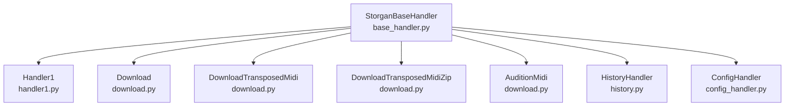

URL の頭には `URL_PREFIX`（既定 `/storgan2`）が付く。表では省いた。

| ハンドラ | URL | 受け持ち |
|---|---|---|
| `Handler1` | `/` | MIDI アップロード → SVG 生成 → プレビュー。履歴からの `stored_midi`（再生成）/ `stored_svg`（再表示）もここが受ける |
| `Download` | `/download/<name>`（SVG）<br>`/download/midi/<name>` | `webroot/svg/` と `webroot/midi/` からのダウンロード |
| `DownloadTransposedMidi` | `/download/midi-transpose/<name>?t=<半音数>` | **アップロード済みの MIDI を、その場で移調して返す**（TODO-042）。ロールブックの音符ではなく元のファイルを移調するだけ。**保存しない** |
| `DownloadTransposedMidiZip` | `/download/midi-transpose-zip/<name>?t=-5,0,3` | 候補ぶんをまとめて ZIP で返す（TODO-050）。**半音数はクエリで受け取り、候補を作り直さない**（1 件版と同じく、名前と半音数だけから作れる形に揃えてある）。こちらも保存しない |
| `AuditionMidi` | `/audition/midi/<name>?t=<半音数>&model=<機種名>` | **その機種で実際に鳴る音だけ**を返す（移調・統合・音階での絞り込みを経たもの）。`Content-Type: audio/midi`、`Content-Disposition` は付けない、**保存しない**（TODO-063） |
| `HistoryHandler` | `/history` | 履歴の一覧。POST は削除の JSON API |
| `ConfigHandler` | `/config` | モデル設定エディタ。`?api=1` で JSON を返す |

`AuditionMidi` と `DownloadTransposedMidi` は目的が違う（試聴と持ち帰る素材）
ので経路を分けてある。`--debug` を付けたときだけ、これに `/livereload`
（`LiveReloadHandler`）が加わる（[7 章](#7-live-reload)）。

### ファイル名は必ず `storage.py` を通す

**ファイル名を外（URL やフォーム）から受け取るときは必ず `storage.py` を
通す。** `safe_name()` が区切り文字と `..` を弾き、`resolve_in()` が解決後も
置き場の中にあることを確かめる。履歴は削除まであるので、ここを迂回すると
事故になる。

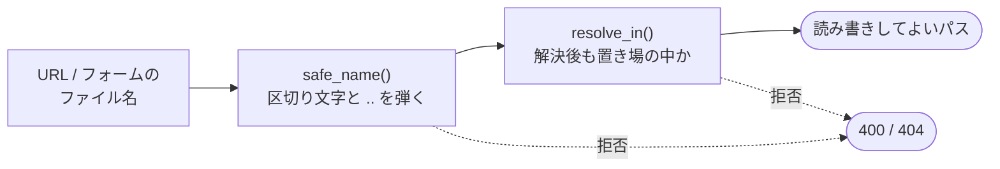

持ち帰り系の 4 つは、この確認とクエリの `t` の読み取りを
`StorganBaseHandler.stored_file()` / `.transpose_arg()` で済ませる
（TODO-072。4 回写してあった）。**`Handler1._stored_path()` と混ぜないこと。**
あちらは画面に理由を出す版で、こちらは HTTP のエラー（400 / 404）を投げる版。

### 置き場

`webroot` / `workdir` は `WebServer` が `Path` に正規化し、`app.settings` にも
`Path` のまま渡す。各ハンドラは `self._webroot / 'svg' / fname` のように
組み立てる。

`webroot/midi/` と `webroot/svg/` は実行時に書き込まれる作業ディレクトリ
（`.gitignore` 済み）。

### テンプレートと静的ファイル

- テンプレート内で URL を組み立てるときは、必ず `{{urlprefix}}` を使う
  （JS からは `window.URL_PREFIX`）。直書きすると prefix を変えたときに
  404 になる。テストは既定値以外の prefix で走らせているので、直書きすると
  `tests/browser/test_rollbook_page.py::test_static_assets_load` が落ちる
- 静的ファイル（CSS / JS / favicon）は `{{ static_url('css/my.css') }}` を
  使う。prefix が付くうえに `?v=<hash>` が付くので、更新したときに古い
  キャッシュを掴まれない

`autoreload=True` **だけでは `.py` しか反映されない**（テンプレートは
`compiled_template_cache`、`?v=<hash>` は `static_hash_cache` が握っている）。
かつて再起動せずに「直したのに変わらない」と悩んだ実績が二度あるので、
`WebServer` はこの 2 つも `False` にしてある。**再起動は不要**。
消すと元の落とし穴に戻る。

画面側（Pico.css の同梱と `:root:root` の話、`confirm()` と `<dialog>` の
使い分け）は [`webroot/CLAUDE.md`](../webroot/CLAUDE.md) にある。

## 7. live reload

`--debug` を付けて起動したときだけ動く。テンプレート / CSS / JS を直すと
**ブラウザが勝手に再読み込みされる**。`livereload.py` に置いてある。

「**切断そのものが更新の合図**」なので、サーバー側にファイル監視のロジックは
無い。

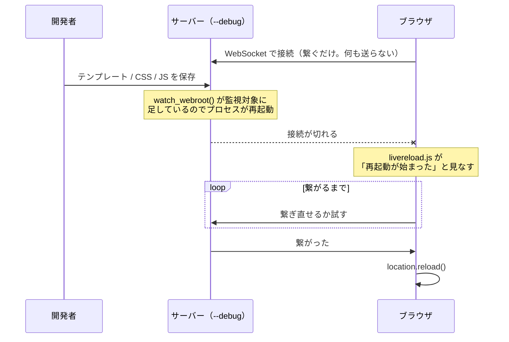

- `watch_webroot()` が `templates/` と `static/` を `tornado.autoreload` の
  監視対象に足す。これで `.py` 以外でも**プロセスが再起動する**
- `LiveReloadHandler` は繋がるだけの WebSocket。**何も送らない**
- `static/js/livereload.js` は繋いだまま待ち、**切れたら**＝再起動が始まった
  と見なして、繋ぎ直せるようになった時点で `location.reload()` する

注意点:

- `<script>` の 1 行は `base.html` に 1 か所あれば全ページに効く。
  `storgan.html` / `config_editor.html` / `history.html` はどれも
  `base.html` を継承している（``）ので、
  ページを増やしてもここは触らなくてよい
- `tornado.autoreload.watch()` は**起動時にあるファイルしか見ない**。
  テンプレートを新規に足したら一度手で再起動する
- 生成結果の画面でリロードすると、表示中のブックは消えて作り直しになる

## 8. ロールブックのビューア

`webroot/static/js/viewer.js`。

### transform で拡縮していない

**SVG の描画サイズ（`.svgbox > svg` の
`height: calc(var(--book-h) * var(--z))`）そのものを変える。**
こうするとブラウザ標準のスクロールがそのまま効き、スクロールバーが全体の
中の現在位置を示す。SVG が mm 単位で出力されているので倍率 1.0 が原寸になる。

汎用の panzoom ライブラリは transform ベースで、縦横比 33:1 のロールブック
ではスクロールバーが消えて現在位置を見失うので使わない。

### 初期表示と位置合わせ

- **初期表示は右端**（`viewBox` が負で、曲の先頭が x=0 側 ＝ 右端にあるため）。
  既定の倍率は「高さ合わせ」。「全体」だと 7% になって何も読めない。
  **先頭へ戻すのは初期表示のときだけ**（TODO-049）。「高さ合わせ」「全体」の
  ボタンは倍率を変えるだけで、位置は他の拡縮と同じく保つ
- **拡縮の位置合わせは「ブック上の位置（mm）」で覚える**（`setZoom()`）。
  基準の点が SVG の右端・上端から何 mm かを実測し、倍率を変えたあとの
  `requestAnimationFrame` で引き戻す

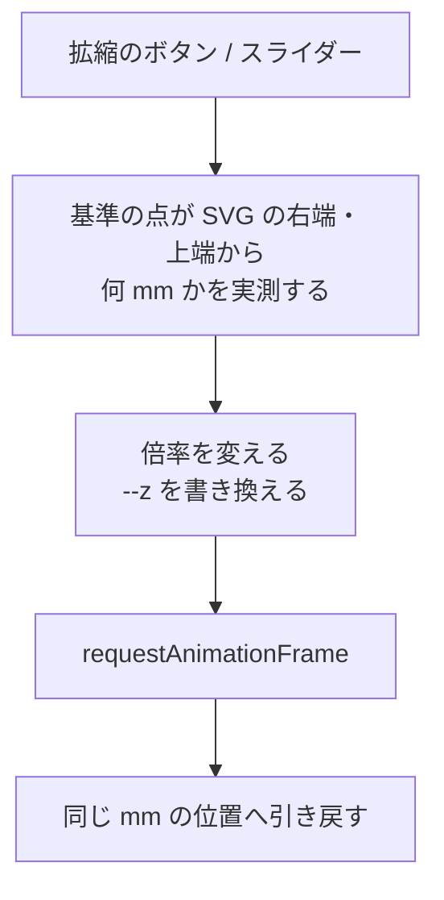

**`scrollWidth` に対する比では駄目。** `padding` は拡縮しないので比が倍率に
対して一定にならず、はみ出していないときは `scrollWidth` が `clientWidth` で
頭打ちになって中央へ飛ぶ。

### ブックの諸元をどう渡すか

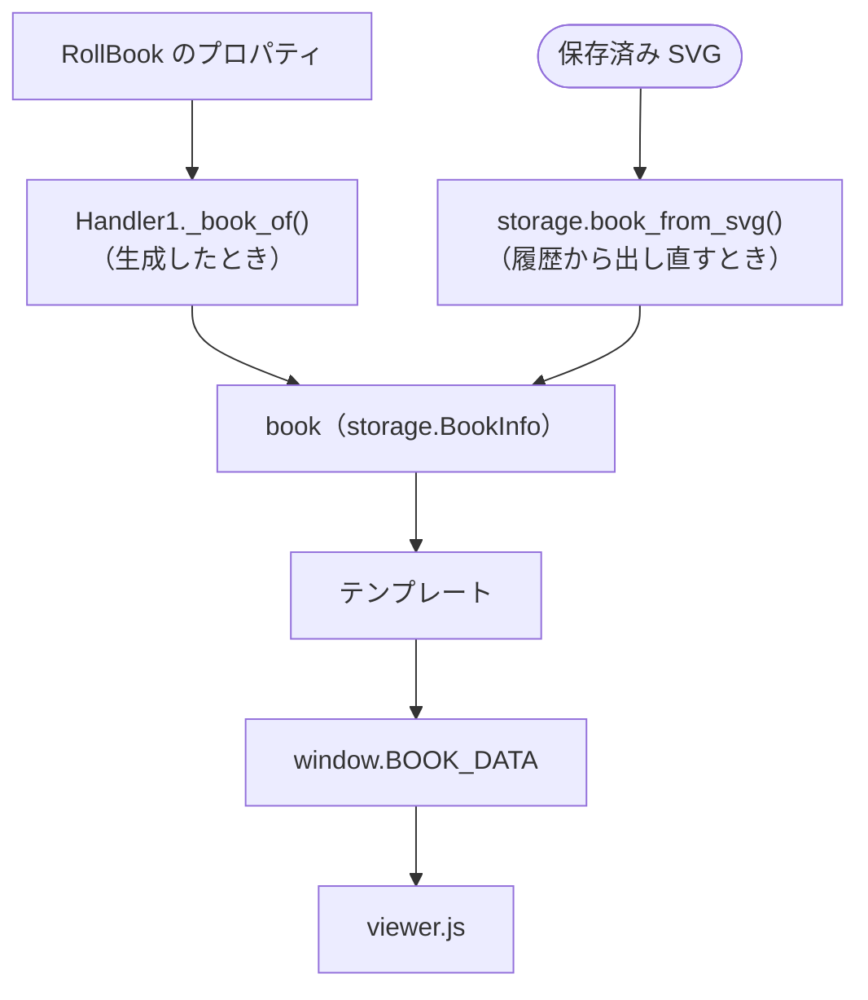

`width` / `height` は SVG の属性にも出ているが、**穴の数と `mm_per_sec` は
SVG からは取り出せない**ので、まとめてここで渡す。

`RollBook.svg()` は、**図からは求まらない値を `<svg>` の属性に埋める**
（`data-storgan-model` / `-mm-per-sec` / `-notes` / `-hole-notes` /
`-off-scale-notes` / `-merged` / `-transpose`）。履歴から保存済みの SVG を
出し直すとき、`storage.book_from_svg()` がこれを読む。寸法と穴の数は図から
読めるので埋めない（二重に持つと手で編集したときに食い違う）。
**属性が無い古い SVG もある**ので、無ければ `---` に落とす。

生成日時は SVG の中ではなく**ファイルの更新日時**から取る
（`storage.mtime_text()`）。SVG は生成したときに書かれるので一致する。

**`book` は 2 か所で組み立てる。項目を増やすときは両方を直すこと。**
型は `storage.BookInfo`（TODO-074）で、`total=True` のまま値を `X | None` に
してある（キーは必ず全部あり、読めなかった値だけが `None`）。片側の付け忘れは
mypy が拾う。往復テストもそのまま残してある。

### 穴の数え方

穴の数は 2 段階 × 2 種類で数える。

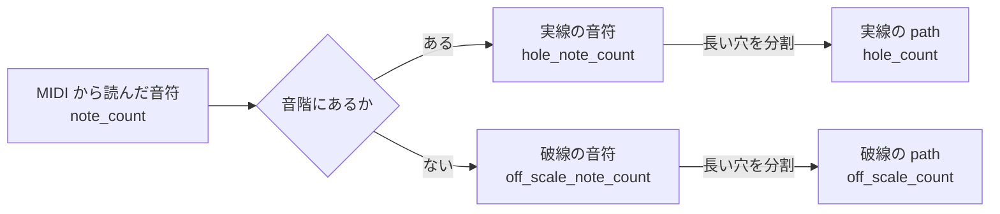

**`RollBook` のプロパティ名と、画面へ渡す `BookInfo` のキー名は違う。**
混同しやすいので並べて書く。

| `RollBook` のプロパティ | `BookInfo` のキー | 意味 |
|---|---|---|
| `note_count` | `notes` | MIDI から読んだ音符の数（実線と破線の合計） |
| `hole_note_count` | `hole_notes` | 実線（音階にある音）の音符 |
| `hole_count` | `holes` | 実線を分割したあとの `<path>` の数 |
| `off_scale_note_count` | `off_scale_notes` | 破線（音階に無い音）の音符 |
| `off_scale_count` | `off_scale` | 破線を分割したあとの `<path>` の数 |

長い穴は `divide_length_by_max_len()` が `'bridge_threshold'` ごとに分割
するので、**音符 1 個が `<path>` 複数本になる**。`'20notes'` と `'20notes a'` は
音階の定義が同じで `'bridge_threshold'` だけ違い（50.0 と 2.7）、
`tests/data/` の `long-notes.mid` では音符 69・実線 68 は変わらないのに、
分割後は 76 と 677 になる。

つまり**分割後の数は `<path>` を数えれば分かるが、分割前の音符の数は
逆算できない**（多対一のため）。前者は数え、後者は属性に埋めてある。

### 画面での見え方

**画面での線の見え方は `my.css` が上書きしている**（0.2px では細すぎて
読めないため、1px + 実線の穴に薄い塗り）。**生成する SVG は変えない。**
詳しくは [`webroot/CLAUDE.md`](../webroot/CLAUDE.md)「ロールブックの見え方
（画面だけ）」。

## 9. ロギング

**標準 `logging` は使わない。** loguru を `mylog.py` 経由で使い、例外は
`exmsg(e)` で整形する。初期化と書式の決めごとは
[tech-stack.md](tech-stack.md) にある。

**`from loguru import logger` を直接書かない**（TODO-086）。

```python
class RollBook:
    __log = getLogger(__qualname__)      # クラスの中

    def parse(self) -> None:
        self.__log.debug('...')

_log = getLogger('storage')              # クラスの無いモジュールは先頭に
```

こうすると `getLogger(name, level)` / `setLevel(name, level)` で
**名前ごとに水準を変えられる**（そこだけ DEBUG にする、そこだけ黙らせる）。
