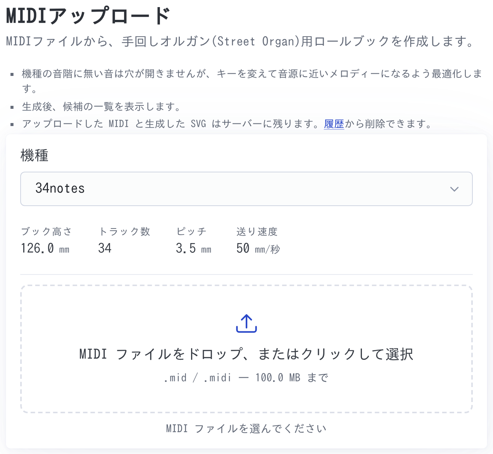
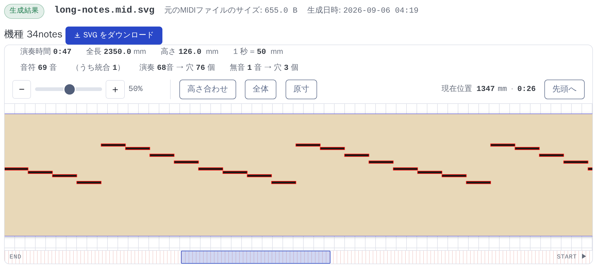
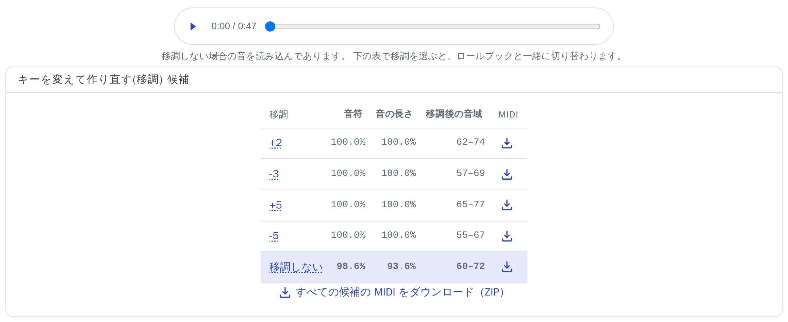
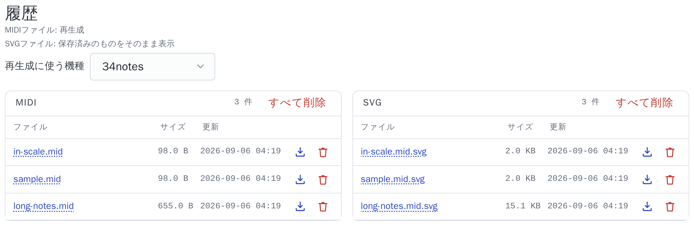
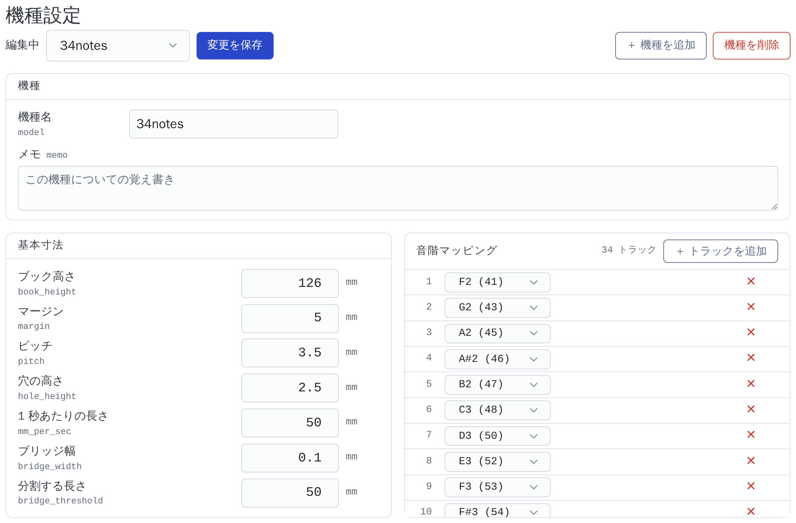

# 使い方

MIDI ファイルから、手回しオルガン用のロールブック（穴あけ用の紙の楽譜）を
作る。操作はブラウザとコマンドラインの 2 通りある。

インストールと設定ファイルの置き方は [README](../README.md) にある。
開発者向けの情報は [Architecture.md](Architecture.md)（内部の作り）、
[Developer.md](Developer.md)（テストと lint）、
[tech-stack.md](tech-stack.md)（依存ライブラリ）にある。

## 目次

- [1. できること](#1-できること)
- [2. 画面で使う言葉](#2-画面で使う言葉)
- [3. ブラウザで使う](#3-ブラウザで使う)
- [4. コマンドラインで使う](#4-コマンドラインで使う)
- [5. 困ったとき](#5-困ったとき)

## 1. できること

- MIDI ファイルを読んで、穴あけ用の SVG を出す。単位は mm なので、
  そのまま原寸で印刷・カットできる
- オルガンの機種（音階と寸法）を選べる。34 音と 20 音の設定を同梱している
- 機種の音階に無い音は、捨てずに**破線**で描く。どの音が鳴らないかを
  目で確かめてから、MIDI 側を直せる
- 曲全体を上下させて（移調）、鳴らせる音を増やせる。候補を並べて選べる
- その機種で実際に鳴る音だけを、ブラウザで試聴できる
- 穴が長くなりすぎるときは、自動で分割して紙のつなぎ（ブリッジ）を残す

## 2. 画面で使う言葉

| 言葉 | 指すもの |
|---|---|
| トラック | 穴の列。並び順がそのまま番号になる |
| 音名 | `F4` のような、そのまま鳴る高さを表すラベル |
| 音階 | その機種が出せる音の集まり |
| 移調 | 曲全体を上下させる半音数 |
| 音の長さ | 鳴らせる音符の**長さの合計**が占める割合 |
| 試聴 | その機種で実際に鳴る音だけを、ブラウザで鳴らして確かめること |

音名は国際標準（scientific pitch notation）で書く。MIDI ノート番号 60 が
`C4`、変化記号はシャープだけを使う（`D#4` とは書くが `Eb4` とは書かない）。

## 3. ブラウザで使う

### 3.1 起動する

**リポジトリのディレクトリで**起動する。テンプレートや、アップロードした
ファイルの置き場（`webroot/`）をそこから読み書きするため。

```bash
$ cd ytstreetorgan
$ ytstreetorgan webapp -p 10081
```

URL だけの行が出るので、そこを開く。

```
  http://localhost:10081/storgan2/
```

止めるときは `Ctrl-C`。

画面は「MIDIアップロード」「履歴」「機種設定」の 3 つで、上の帯から
行き来する。

### 3.2 ロールブックを作る



- 機種の音階に無い音は穴が開かないが、キーを変えて音源に近いメロディーに
  なるよう最適化する
- アップロードした MIDI と生成した SVG はサーバーに残る。履歴から削除できる

1. **機種を選ぶ。** 選ぶと、その機種のブック高さ・トラック数・ピッチ・
   送り速度が下に出る。作ってから寸法違いに気づかずに済む
2. **MIDI ファイルを選ぶ。** 枠にドロップするか、枠を押してファイルを選ぶ。
   `.mid` と `.midi`、既定では 100 MB まで
3. 選んだ時点で送信が始まり、生成結果の画面に変わる

移調はここでは選ばない。**作ると候補の表が出る**ので、そこで選び直す。

同じ名前のファイルを前にアップロードしていると、確認のダイアログが出る。

| ボタン | すること |
|---|---|
| 置き換えて変換 | 今度のファイルで置き換えて作る |
| 前回のファイルで変換 | サーバーにある前回のファイルで作る |
| キャンセル | 何もしない |

### 3.3 生成結果を見る



上の行に、ファイル名・元の MIDI のサイズ・生成日時・機種と、
「SVG をダウンロード」のボタンが並ぶ。

ブックの諸元は次のとおり。

| 表示 | 意味 |
|---|---|
| 演奏時間 | ブック全体の時間 |
| 全長 | ブックの長さ [mm] |
| 高さ | ブックの高さ [mm] |
| 1 秒 = ◯ mm | 紙を送る速さ。機種設定の `mm_per_sec` |
| 移調 | 曲全体を上下させた半音数 |
| 音符 ◯ 音 | MIDI から読んだ音符の数 |
| （うち統合 ◯） | 同じ高さの音が重なっていたので、1 つにまとめた数 |
| 演奏 ◯ 音 → 穴 ◯ 個 | 音階にある音符の数 → 分割したあとの穴の数 |
| 無音 ◯ 音 → 穴 ◯ 個 | 音階に無い音符の数 → 分割したあとの破線の数 |

実機は 1 つの音に 1 本のパイプしか無いので、同じ高さが重なっていても
鳴るのは 1 本ぶんになる。だから重なりは 1 つの穴にまとめる。

長い穴は途中で分割して紙のつなぎ（ブリッジ）を残すため、**音符 1 つが
穴 2 つ以上になる**ことがある。「◯ 音 → 穴 ◯ 個」の右側が分割したあとの数。

図の中では、**実線が実際に開ける穴**、**破線が音階に無くて開けない音**。

#### ビューアの操作

| 操作 | すること |
|---|---|
| − / ＋ / スライダー | 拡大・縮小 |
| Ctrl（⌘）＋ ホイール | 同上。ポインタの下の位置は動かない |
| ホイール、ドラッグ | 送る |
| 高さ合わせ | ブックの高さが画面に収まる倍率にする |
| 全体 | 全長が画面に収まる倍率にする |
| 原寸 | 画面上で実際の紙と同じ大きさにする（96dpi 換算） |
| 先頭へ | 曲の先頭（右端）へ戻る |
| 下の帯 | 押すとその位置へ移る。枠をドラッグしても送れる |

ロールブックは**右から左へ**流れる。開いた直後は曲の先頭（右端）を、
高さを合わせた倍率で出す。倍率を変えても、見ている位置は保つ。

「現在位置」には、先頭から何 mm の地点を見ているかと、それが何分何秒に
あたるかが出る。

### 3.4 移調の候補から選び直す



機種の音階に無い音は穴が開かない。曲全体を上下させると（移調）、
鳴らせる音が増えることがある。その候補が表になっている。

| 列 | 意味 |
|---|---|
| 移調 | 上下させる半音数。**押すと、その移調でロールブックを作り直す** |
| 音符 | 鳴らせる音符の数が占める割合 |
| 音の長さ | 鳴らせる音符の長さの合計が占める割合 |
| 移調後の音域 | 移調したあとの MIDI ノート番号の範囲 |
| MIDI | その移調量で移調した MIDI をダウンロードする |

- いま表示しているロールブックの行には色が付く
- 移調しない場合より少ない（短い）値には **▼** が付く。音符は増えるが
  長さは減る、という候補も選べるように、その行も残してある
- 移調しても良くならない曲では、表を出さずに一文だけ出す
- MIDI の保存アイコンが渡すのは、**アップロードした MIDI をその移調量で
  移調したもの**で、ロールブックではない。音階に無い音もそのまま残る
- 「すべての候補の MIDI をダウンロード（ZIP）」で、表にある移調量ぶんを
  まとめてダウンロードできる

### 3.5 試聴する

表の上にあるプレーヤーで、**その機種で実際に鳴る音だけ**を聴ける。
重なりをまとめ、移調し、音階に無い音を取り除いたあとの音になる。

読み込んであるのは、いま表示しているロールブックの移調量の音。表から
別の移調を選ぶと、ロールブックと一緒に切り替わる。自動では鳴らないので、
▶ を押す。

### 3.6 SVG をダウンロードする

「SVG をダウンロード」で保存する。mm 単位で書いてあるので、原寸で印刷・
カットできる。線にはヘアラインの指定を付けてあり、カッティングにそのまま
渡せる。

### 3.7 履歴



アップロードした MIDI と、生成した SVG の一覧。

- **MIDI の名前を押すと再生成。** 上の「再生成に使う機種」で選んだ機種で
  作り直す
- **SVG の名前を押すと、保存済みのものをそのまま表示。** 作り直さない
- 保存アイコンでダウンロード、ゴミ箱で削除。「すべて削除」もある

保存済みの SVG をそのまま表示したときは、「履歴表示」と出る。作り直しでは
ないので、移調の候補と試聴は出ない。諸元は SVG に埋めてあるものを読むが、
**古い SVG には埋まっていない**ことがあり、その項目は `---` になる。

### 3.8 機種設定



オルガンの機種を追加・編集する。編集した内容は「変更を保存」を押すまで
書き込まれない。

上の段:

| ボタン | すること |
|---|---|
| 編集中 | 編集する機種を選ぶ |
| 変更を保存 | いま編集している機種を書き込む |
| ＋ 機種を追加 | 名前を付けて、既存の機種から設定を写して作る |
| 機種を削除 | いま編集している機種を消す（最後の 1 つは消せない） |

基本寸法:

| 項目 | 意味 |
|---|---|
| ブック高さ `book_height` | 紙の高さ [mm] |
| マージン `margin` | 上下の余白 [mm] |
| ピッチ `pitch` | 隣り合うトラックの間隔 [mm] |
| 穴の高さ `hole_height` | 穴 1 つの高さ [mm] |
| 1 秒あたりの長さ `mm_per_sec` | 紙を送る速さ [mm/秒] |
| ブリッジ幅 `bridge_width` | 分割したときに残すつなぎの幅 [mm] |
| 分割する長さ `bridge_threshold` | この長さを超える穴を分割する [mm] |

音階マッピングは、トラック（穴の列）ごとの音名。

- 番号がトラック番号で、**並び順がそのまま穴の列の並び**になる
- 音名はドロップダウンで選ぶ。括弧の中は参考の MIDI ノート番号
- 音名を選ぶと、低い音が上になるように並べ替わる。**トラック番号も
  振り直される**
- 「＋ トラックを追加」で行を足し、「✕」で行を消す

保存すると、前の内容が `.bak` として残る。

## 4. コマンドラインで使う

```bash
$ ytstreetorgan --help          # サブコマンドの一覧
$ ytstreetorgan SUB_COMMAND -h  # サブコマンドの使い方
```

サブコマンドは 4 つ。

| コマンド | すること |
|---|---|
| `rollbook` | MIDI からロールブックの SVG を作る |
| `parse` | MIDI を解析して中身を表示する |
| `play` | MIDI を再生する |
| `webapp` | Web サーバーを起動する |

どれにも `-h`（使い方）、`-d`（デバッグログ）、`-V`（バージョン）がある。
`-v` も普通はバージョンだが、**`parse` だけは `-v` が図の表示**なので、
バージョンは `-V` で聞く。

### 4.1 `rollbook` — SVG を作る

```bash
$ ytstreetorgan rollbook FILE.mid -m 34notes
$ ytstreetorgan rollbook FILE.mid -m 34notes -t auto -o book.svg
```

| オプション | 既定 | 意味 |
|---|---|---|
| `-m`, `--model` | `34notes` | 機種名 |
| `-o`, `--out_file` | `~/Desktop/<MIDI名>.svg` | 出力先 |
| `-t`, `--transpose` | `0` | 移調する半音数。`auto` で鳴らせる音符が最多になる値を選ぶ |
| `-c`, `--channel` | 全部 | 対象の MIDI チャンネル（複数指定できる） |
| `-f`, `--conf_file` | 探索する | 設定ファイル |

作ったあとに、移調の候補を表にして出す。**移調を指定していなくても出す**
ので、別の値で作り直すかどうかを見て決められる。

```
移調: -1 半音  鳴らせる音符: 8/8
  調  ｵｸﾀｰﾌﾞ   移調     音符   音の長さ      音域
  ---------------------------------------------------
   +1     +0     +1   100.0%    100.0%    62-74
   -1     +0     -1   100.0%    100.0%    60-72    ←選択
   +4     +0     +4   100.0%    100.0%    65-77
   -4     +0     -4   100.0%    100.0%    57-69
   +6     -1     -6   100.0%    100.0%    55-67
   +0     +0     +0    87.5%     87.5%    61-73    調そのまま
```

実際に効くのは「移調」の列（合計の半音数）だけで、「調」と「オクターブ」は
その内訳。**調が ±0 でも、オクターブが動いていればキーだけが同じ**で、
「移調しない」とは違う。

### 4.2 `parse` — 中身を見る

```bash
$ ytstreetorgan parse FILE.mid              # 音符の一覧
$ ytstreetorgan parse FILE.mid -v           # 図にして出す
$ ytstreetorgan parse FILE.mid -m 34notes   # 移調の候補も出す
```

| オプション | 既定 | 意味 |
|---|---|---|
| `-v`, `--visual` | 出さない | 解析結果を図にして出す |
| `-m`, `--model` | 指定なし | 機種名。指定すると移調の候補を表にして出す |
| `-t`, `--transpose` | `0` | 移調する半音数（`-m` と併せて使う） |
| `-c`, `--channel` | 全部 | 対象の MIDI チャンネル |
| `-f`, `--conf_file` | 探索する | 設定ファイル（`-m` を指定したときだけ使う） |

`-v` を付けると、縦が時間、横が MIDI ノート番号の図になる。大文字が
音の始まり、小文字が終わり。

```
        |0000000000000|
        |6666666667777|
        |1234567890123|
--------+-------------+
0000.000|A            |
0000.500|a A          |
0001.000|  a A        |
```

`-m` を付けたときの「鳴らせる音符」の分母は、重なりをまとめたあとの数。
画面の割合と揃えてある。

### 4.3 `play` — 鳴らす

```bash
$ ytstreetorgan play FILE.mid                        # そのまま鳴らす
$ ytstreetorgan play FILE.mid -m 34notes -t auto     # その機種で鳴る音だけ
```

| オプション | 既定 | 意味 |
|---|---|---|
| `-m`, `--model` | 指定なし | 指定すると、その機種の音階に無い音を除いて鳴らす |
| `-t`, `--transpose` | `0` | 移調する半音数（`-m` と併せて使う） |
| `-s`, `--pos_sec` | `0.0` | 鳴らし始める位置 [秒] |
| `-r`, `--rate` | `22050` | サンプリング周波数 [Hz] |
| `--min` / `--max` | `0.02` / `1.2` | 1 音を鳴らす時間の下限・上限 [秒] |
| `-c`, `--channel` | 全部 | 対象の MIDI チャンネル |
| `-f`, `--conf_file` | 探索する | 設定ファイル（`-m` を指定したときだけ使う） |

`-m` を付けると、ブラウザの試聴と同じ音になる。どう移調したかは
1 行の知らせで出る。

```
[34notes] 移調しません → 鳴らせる音符 7 個（87.5%、音の長さ 87.5%）
```

### 4.4 `webapp` — Web サーバー

```bash
$ ytstreetorgan webapp -p 10081
$ ytstreetorgan webapp -p 10081 --debug   # 画面を直すと自動で読み込み直す
```

| オプション | 既定 | 意味 |
|---|---|---|
| `-p`, `--port` | `10081` | ポート番号 |
| `-u`, `--urlprefix` | `/storgan2` | URL の頭に付ける文字列 |
| `-r`, `--webroot` | `./webroot` | テンプレートとファイルの置き場 |
| `-w`, `--workdir` | `/tmp` | 作業用のディレクトリ |
| `-l`, `--size_limit` | 100 MB | アップロードの上限 [バイト] |

`--debug` を付けると、テンプレートや CSS を直したときにブラウザが自動で
読み込み直す（開発用）。

## 5. 困ったとき

### `storgan-conf.json が見つかりません` と出る

機種を定義した設定ファイルが要る。同梱のテンプレートを、探索する場所の
どれかにコピーする。

```bash
$ mkdir -p ~/.config && cp conf/storgan-conf.json ~/.config/
```

探す順番は `.` → `~/.config` → `~/etc` → `/usr/local/etc` → `/etc` で、
最初に見つかったものを使う。メッセージには探した場所が並ぶので、どこに
置けばよいかはそこで分かる。

### 破線ばかりになる

MIDI の音域が、その機種の音階から外れている。移調の候補を見て、鳴らせる
音符の割合が高い行を選んで作り直す。それでも改善しないときは、機種の
選び違いか、MIDI 側に音域の広いパートが混ざっている。`-c` で
チャンネルを絞ると分かることがある。

### 試聴の音が鳴らない

▶ を押していない（自動では鳴らない）か、機種の音階に鳴らせる音が
1 つも残っていない。ブラウザの音量も確かめる。

### アップロードすると画面が真っ白になる

上限を超えたファイルを送ると、サーバーが本文を読まずに接続を切る。
`-l` で上限を上げるか、MIDI を小さくする。

### 生成した SVG が溜まる

`webroot/midi/` と `webroot/svg/` に残る。履歴の画面から削除できる。
