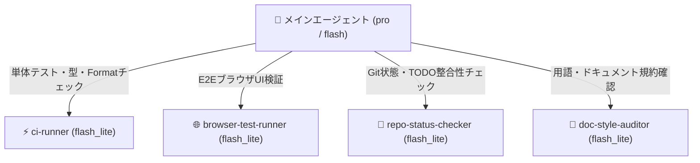

# 定型検証サブエージェントの委任設計・運用ガイド

作成: 2026-08-09

## 1. 目的と背景

[multi_agent_token_savings.md](file:///home/ytani/work/ytstreetorgan/docs/multi_agent_token_savings.md) にて整理した通り、メインエージェント（Pro / Opus 級モデル）のトークン消費を抑え、開発効率を高めるためには**定型検証作業のサブエージェント委任**が極めて有効である。

本ドキュメントでは、本リポジトリ（`ytstreetorgan`）で実施された過去の TODO 項目および日常の開発運用を踏まえ、**具体的にどのようなサブエージェントが必要か**、その役割・仕様・起動方法を定義する。

---

## 2. 過去の TODO から抽出した定型検証タスク

これまでの開発実績（全 60 件の TODO）から、頻繁に繰り返し実行される定型的な検証作業として以下の 4 領域が抽出された。

| 領域 | 主な検証内容 | 関連する過去 TODO |
|---|---|---|
| **静的解析・型・単体テスト** | `pytest` によるユニットテスト、`ruff` による Lint / Format、`mypy` / `basedpyright` による型チェック | [TODO-044](file:///home/ytani/work/ytstreetorgan/archives/todo/TODO-044.%20basedpyright%20%E3%81%AE%E3%81%9D%E3%81%AE%E4%BB%96%E3%81%AE%E8%AD%A6%E5%A0%B1.md), [TODO-059](file:///home/ytani/work/ytstreetorgan/archives/todo/TODO-059.%20webUI%20%E8%A1%A8%E7%A4%BA%E5%A4%89%E6%9B%B4%E3%81%AB%E5%90%88%E3%82%8F%E3%81%9B%E3%81%9F%E3%82%BF%E3%82%A4%E3%83%9D%E4%BF%AE%E6%AD%A3%E3%81%A8%E3%83%86%E3%82%B9%E3%83%88%E3%81%AE%E8%BF%BD%E5%BE%93.md) |
| **ブラウザ E2E テスト** | `pytest -m browser` (Playwright) による Web UI の表示・操作性テスト | [TODO-014](file:///home/ytani/work/ytstreetorgan/archives/todo/TODO-014.%20%E3%83%96%E3%83%A9%E3%82%A6%E3%82%B6%E3%83%86%E3%82%B9%E3%83%88%E3%82%92%E6%95%B4%E5%82%99%E3%81%99%E3%82%8B.md), [TODO-059](file:///home/ytani/work/ytstreetorgan/archives/todo/TODO-059.%20webUI%20%E8%A1%A8%E7%A4%BA%E5%A4%89%E6%9B%B4%E3%81%AB%E5%90%88%E3%82%8F%E3%81%9B%E3%81%9F%E3%82%BF%E3%82%A4%E3%83%9D%E4%BF%AE%E6%AD%A3%E3%81%A8%E3%83%86%E3%82%B9%E3%83%88%E3%81%AE%E8%BF%BD%E5%BE%93.md) |
| **Git / TODO 運用検証** | コミット前の未追跡ファイルチェック、TODO の採番・リンク切れ・2回分割コミットルールの確認 | [TODO-057](file:///home/ytani/work/ytstreetorgan/archives/todo/TODO-057.%20TODO%20%E9%81%8B%E7%94%A8%E3%81%AE%E9%A3%9F%E3%81%84%E9%85%95%E3%81%91%E3%82%92%E3%82%B0%E3%83%AD%E3%83%BC%E3%83%90%E3%83%AB%E3%81%AE%E6%B1%BA%E3%81%BE%E3%82%8A%E3%81%AB%E2%80%9D%E5%AF%84%E3%81%9B%E3%82%8B.md), [TODO-060](file:///home/ytani/work/ytstreetorgan/archives/todo/TODO-060.%20%E3%83%89%E3%82%AD%E3%83%A5%E3%83%A1%E3%83%B3%E3%83%88%20docs/multi_agent_token_savings.md%20%E3%81%B8%E3%83%AC%E3%83%93%E3%83%A5%E3%83%BC%E3%81%AB%E5%9F%BA%E3%81%A5%E3%81%8F%E8%A3%9C%E8%B6%B3%E3%83%BB%E6%8F%90%E6%A1%88%E3%81%AE%E7%B5%84%E3%81%BF%E8%BE%BC%E3%81%BF.md) |
| **ドキュメント・用語規約監査** | 用語規約（「ノート」禁止、「MIDIノート番号」推奨）、ドキュメントの絶対パスリンクチェック | プロジェクト固有ルール (`CLAUDE.md`) |

---

## 3. 定型検証サブエージェントの詳細仕様

上記 4 領域に対応するため、以下の 4 つのサブエージェントを定義する。
いずれもコンテキストが軽く高速な **`flash_lite`**（または必要に応じて `flash`）を指定して起動する。



### 1. `ci-runner` (CI / テスト・静的解析ランナー)

- **推奨モデル**: `flash_lite`
- **主な役割**:
  - `uv run pytest`（単体テスト・統合テスト）の実行
  - `uv run ruff check .` および `uv run ruff format --check .` の実行
  - `uv run mypy src` または `uv run basedpyright` の実行
- **出力ルール**:
  - 成功時: 「全緑（テスト N 件合格、Linter/型チェックエラーなし）」と簡潔に報告。
  - 失敗時: 全ログを出力せず、**失敗したファイル名・行番号・エラーの要約（トレースバック末尾）のみ**を抜き出してメインエージェントに返す。

### 2. `browser-test-runner` (ブラウザ E2E ランナー)

- **推奨モデル**: `flash_lite`
- **主な役割**:
  - `uv run pytest -m browser` による Playwright テストの実行
  - Web UI や Tornado ハンドラ追加・変更時の挙動検証
- **出力ルール**:
  - テスト結果の成功 / 失敗要約。
  - スナップショット比較や要素検出エラーが発生した場合、該当テスト名と失敗ステップを短く報告。

### 3. `repo-status-checker` (Git & TODO 運用状態チェッカー)

- **推奨モデル**: `flash_lite`
- **主な役割**:
  - `git status` / `git diff --stat` による作業状態の確認
  - `TODO.md` の未完了項目・目次・採番順の整合性チェック
  - コミット前のルールチェック（TODO追加時コミットと完了時コミットの2分割遵守など）
- **出力ルール**:
  - 未コミット変更のファイル一覧とステータス
  - TODO.md / archives 間のリンク切れやフォーマット不備の指摘

### 4. `doc-style-auditor` (ドキュメント・表記規約チェッカー)

- **推奨モデル**: `flash_lite`
- **主な役割**:
  - ドキュメント作成・更新時の `file:///` 形式リンクの妥当性確認
  - 用語規約チェック（「ノート」単体使用の警告、SVG 座標系の負値仕様等）
- **出力ルール**:
  - 規約違反があった箇所（ファイル名、行番号、該当文字列）の箇条書き報告。

---

## 4. サブエージェントの起動とプロンプト設計例

### メインエージェントからの呼び出し方 (`invoke_subagent`)

`define_subagent` で事前にサブエージェントを宣言するか、`invoke_subagent` 呼び出し時に具体的な指示を与える。

#### 例: `ci-runner` への委任呼び出し

```yaml
invoke_subagent:
  TypeName: "ci-runner"
  Model: "flash_lite"
  Role: "CI Test & Lint Verification Runner"
  Prompt: |
    以下のコマンドを実行し、結果を要約して報告してください。
    1. uv run pytest
    2. uv run ruff check .
    3. uv run mypy src
    
    【出力ルール】
    - すべて成功した場合は「全テスト合格・エラーなし」と1行で答えてください。
    - エラーがある場合は、全体のログではなく「失敗したファイル名・行番号・主なエラーメッセージ」のみを抽出して箇条書きで報告してください。
```

---

## 5. 委任の判断基準 (トレーディングオフとルール)

すべての検証をサブエージェントに振るべきではない。通信および文脈切り替えのオーバーヘッドが存在するため、以下の基準で判断する。

| パターン | 推奨する手法 | 理由 |
|---|---|---|
| **単一の軽量コマンド**<br>（例: `ruff check` のみ 1 回打つ） | メインエージェントが**直接実行** | サブエージェント起動オーバーヘッド（時間・トークン）の方が大きいため。 |
| **複合的な全件検証**<br>（例: プッシュ前に `pytest` + `ruff` + `mypy` を流す） | **`ci-runner` サブエージェントへ委任** | 成功時の大量ログをメインエージェントのコンテキストに持ち込まずに済むため。 |
| **重い E2E テスト**<br>（例: ブラウザ起動テスト全件） | **`browser-test-runner` へ委任** | 実行時間が長くログが大きいため、コンテキスト分離が効果的。 |
| **コード変更前の現状確認** | メインエージェントが**直接実行** | 調査結果を直接設計判断に使う場合は、メインエージェント自身で見たほうが早い。 |

---

## 6. 今後の永続化構成（推奨案）

本プロジェクトで頻繁に使用するサブエージェントは、リポジトリ内の `.agents/agents/<agent-name>/AGENTS.md` に配置することで、セッションを超えて共有・再利用が可能になる。

- `.agents/agents/ci-runner/AGENTS.md`
- `.agents/agents/repo-status-checker/AGENTS.md`

段階的にこれらの定義ファイルを整備し、スムーズに定型検証を委任できる環境を整えていく。
